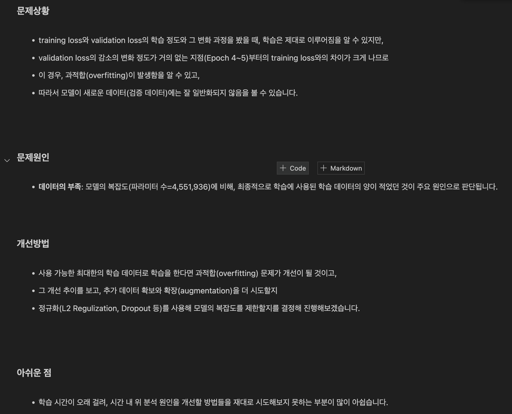

# AIFFEL Campus Online Code Peer Review Templete
- 코더 : 김석영
- 리뷰어 : 김민식


# PRT(Peer Review Template)
- [O]  **1. 주어진 문제를 해결하는 완성된 코드가 제출되었나요?**
    - 문제에서 요구하는 최종 결과물이 첨부되었는지 확인
    > 노트북 파일에 각 과정이 에러없이 잘 수행되었습니다.
    - 문제를 해결하는 완성된 코드란 프로젝트 루브릭 3개 중 2개, 
      퀘스트 문제 요구조건 등을 지칭
      1. pretrain용 데이터셋을 잘 생성하였다.
      2. 구현한 BERT 모델의 학습이 안정적으로 진행됨을 확인하였다.
        - 해당 조건을 만족하는 코드를 캡쳐해 근거로 첨부
        > 1번 근거
        ```python
          # 데이터셋 생성하여 JSON 파일로 저장하는 코드
          make_pretrain_data(vocab, corpus_file, pretrain_json_path, 128)
          # JSON 파일 크기 확인한 코드
          total = 0
          with open(pretrain_json_path, "r") as f:
              for line in f:
                  total += 1
          total
        ```
        > 2번 근거
        ```python
        # 모델 훈련 부분
        history = test_model.fit(
            (enc_tokens_train, segments_train),
            (labels_nsp_train, labels_mlm_train),
            validation_data=((enc_tokens_val, segments_val), (labels_nsp_val, labels_mlm_val)),
            epochs=30,
            batch_size=5
        )
        ```
    
- [O]  **2. 전체 코드에서 가장 핵심적이거나 가장 복잡하고 이해하기 어려운 부분에 작성된 
  주석 또는 doc string을 보고 해당 코드가 잘 이해되었나요?**
    - 해당 코드 블럭에 doc string/annotation이 달려 있는지 확인
    - 해당 코드가 무슨 기능을 하는지, 왜 그렇게 짜여진건지, 작동 메커니즘이 뭔지 기술.
    - 주석을 보고 코드 이해가 잘 되었는지 확인
        - 잘 작성되었다고 생각되는 부분을 캡쳐해 근거로 첨부합니다.
    > pre-train 데이터셋을 생성하는 함수에서 주석을 보고 이해가 잘 되었습니다.
    ```python
    def make_pretrain_data(vocab, in_file, out_file, n_seq, mask_prob=0.15):
    """ pretrain 데이터 생성 """
    def save_pretrain_instances(out_f, doc):
        instances = create_pretrain_instances(vocab, doc, n_seq, mask_prob, vocab_list)
        for instance in instances:
            out_f.write(json.dumps(instance, ensure_ascii=False))
            out_f.write("\n")

    # 특수문자 7개를 제외한 vocab_list 생성
    vocab_list = []
    for id in range(7, len(vocab)):
        if not vocab.is_unknown(id):        # 생성되는 단어 목록이 unknown인 경우는 제거합니다.
            vocab_list.append(vocab.id_to_piece(id))

    # line count 확인
    line_cnt = 0
    with open(in_file, "r") as in_f:
        for line in in_f:
            line_cnt += 1

    with open(in_file, "r") as in_f:
        with open(out_file, "w") as out_f:
            doc = []
            for line in tqdm(in_f, total=line_cnt):
                line = line.strip()
                if line == "":  # line이 빈줄 일 경우 (새로운 단락)
                    if 0 < len(doc):
                        save_pretrain_instances(out_f, doc)
                        doc = []  # Resetting doc for the next paragraph
                else:  # line이 빈줄이 아닐 경우 tokenize 해서 doc에 저장
                    pieces = vocab.encode_as_pieces(line)
                    if 0 < len(pieces):
                        doc.append(pieces)
            if 0 < len(doc):  # 마지막에 처리되지 않은 doc가 있는 경우
                doc = []  # Clear the doc
    ```
  
- [X]  **3. 에러가 난 부분을 디버깅하여 문제를 “해결한 기록을 남겼거나” 
  ”새로운 시도 또는 추가 실험을 수행”해봤나요?**
    - 문제 원인 및 해결 과정을 잘 기록하였는지 확인
    - 문제에서 요구하는 조건에 더해 추가적으로 수행한 나만의 시도, 
      실험이 기록되어 있는지 확인
        - 잘 작성되었다고 생각되는 부분을 캡쳐해 근거로 첨부합니다.
  > 직접적인 시도는 없는것 같습니다.
  
- [O]  **4. 회고를 잘 작성했나요?**
    - 주어진 문제를 해결하는 완성된 코드 내지 프로젝트 결과물에 대해
    배운점과 아쉬운점, 느낀점 등이 기록되어 있는지 확인
    - 전체 코드 실행 플로우를 그래프로 그려서 이해를 돕고 있는지 확인
        - 잘 작성되었다고 생각되는 부분을 캡쳐해 근거로 첨부합니다.
  > 전체 진행과정에 대한 회고를 잘 해주셨습니다.
  
    
- [O]  **5. 코드가 간결하고 효율적인가요?**
    - 파이썬 스타일 가이드 (PEP8) 를 준수하였는지 확인
    - 하드코딩을 하지않고 함수화, 모듈화가 가능한 부분은 함수를 만들거나 클래스로 짰는지
    - 코드 중복을 최소화하고 범용적으로 사용할 수 있도록 함수화했는지
        - 잘 작성되었다고 생각되는 부분을 캡쳐해 근거로 첨부합니다.
  ```python
  class BERT(tf.keras.layers.Layer):
    """
    BERT Class
    """
    def __init__(self, config, name="bert"):
        """
        생성자
        :param config: Config 객체
        :param name: layer name
        """
        super().__init__(name=name)

        self.i_pad = config.i_pad
        self.embedding = SharedEmbedding(config)
        self.position = PositionEmbedding(config)
        self.segment = tf.keras.layers.Embedding(2, config.d_model, embeddings_initializer=kernel_initializer())
        self.norm = tf.keras.layers.LayerNormalization(epsilon=config.layernorm_epsilon)

        self.encoder_layers = [EncoderLayer(config, name=f"encoder_layer_{i}") for i in range(config.n_layer)]

        self.dropout = tf.keras.layers.Dropout(config.dropout)

    def call(self, inputs):
        """
        layer 실행
        :param inputs: (enc_tokens, segments)
        :return logits: dec_tokens에 대한 다음 토큰 예측 결과 logits
        """
        enc_tokens, segments = inputs

        enc_self_mask = tf.keras.layers.Lambda(get_pad_mask, output_shape=(1, None), name='enc_self_mask')(enc_tokens, self.i_pad)

        enc_embed = self.get_embedding(enc_tokens, segments)

        enc_out = self.dropout(enc_embed)
        for encoder_layer in self.encoder_layers:
            enc_out = encoder_layer(enc_out, enc_self_mask)

        logits_cls = enc_out[:,0]
        logits_lm = self.embedding(enc_out, mode="linear")
        return logits_cls, logits_lm

    def get_embedding(self, tokens, segments):
        """
        token embedding, position embedding lookup
        :param tokens: 입력 tokens
        :param segments: 입력 segments
        :return embed: embedding 결과
        """
        embed = self.embedding(tokens) + self.position(tokens) + self.segment(segments)
        embed = self.norm(embed)
        return embed
  ```


# 참고 링크 및 코드 개선
```
# 코드 리뷰 시 참고한 링크가 있다면 링크와 간략한 설명을 첨부합니다.
# 코드 리뷰를 통해 개선한 코드가 있다면 코드와 간략한 설명을 첨부합니다.
